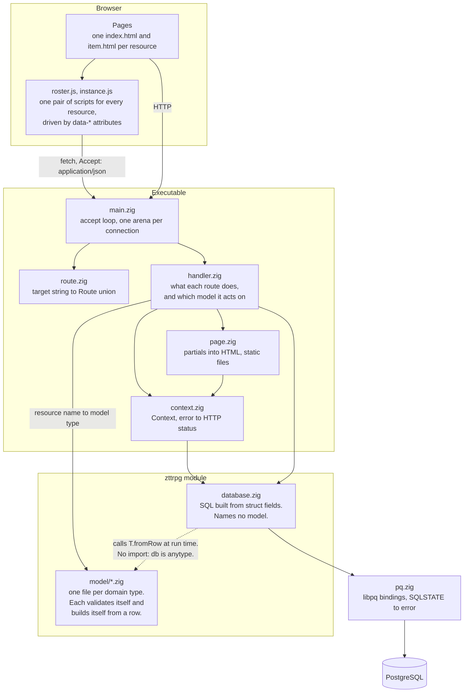
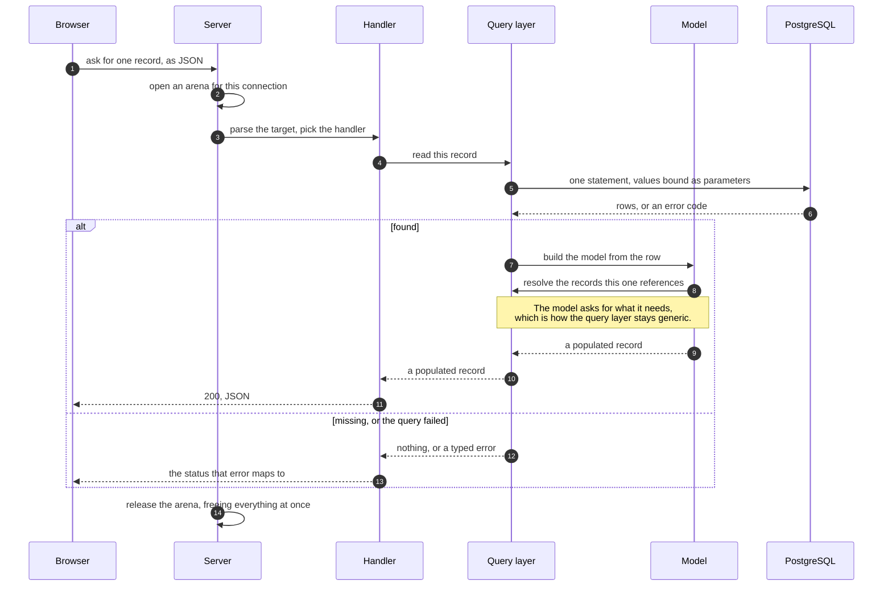
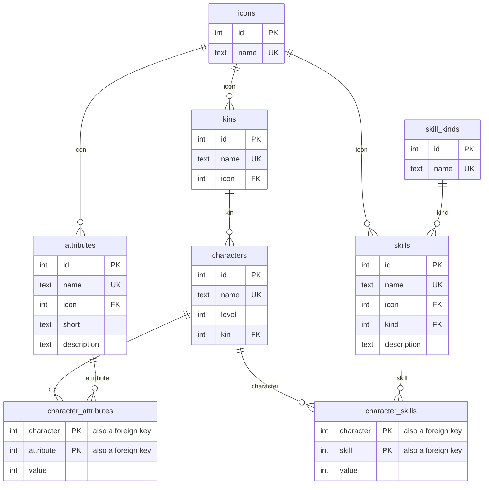

# ZTTRPG

ZTTRPG is a web application for a tabletop role-playing game. It is written in Zig and stores its data in PostgreSQL. It keeps a roster of characters, each with a kin, a set of attributes, and a set of skills.

Zig is the only toolchain. There is no `node_modules/`, no bundler, and no `package.json`: the browser assets are hand-written and served as they are.

## Requirements

- Zig 0.16.0
- PostgreSQL, with a local database named `zttrpg`

The build system downloads and compiles libpq. You do not install libpq yourself.

## Setup

1. Start PostgreSQL.
2. Create the database:

   ```sh
   createdb zttrpg
   ```

3. Apply the database migrations:

   ```sh
   zig build migration
   ```

The migration tool runs each `.sql` file in the `db/` directory in name order. It records each applied file in the `schema_migrations` table. It does not run a file twice.

## Run

Run the server from the repository root:

```sh
zig build run
```

The server listens on `http://127.0.0.1:8080`.

Note: the server reads pages and assets from `src/web/`, relative to the current directory. If you start the binary from another directory, no page loads.

Pages are read from disk on every request. Edit a file in `src/web/` and refresh the browser: there is no rebuild step for HTML, CSS, or JavaScript.

## Build steps

| Command | Action |
|---|---|
| `zig build run` | Build and start the server. |
| `zig build test` | Run every test. |
| `zig build migration` | Apply the pending migrations in `db/`. |
| `zig build icons` | Regenerate `src/web/static/icons/` from the icon package. |
| `zig build sqls` | Regenerate the seed `.sql` files in `db/` from the JSON in `src/data/`. |

## Architecture

A request enters at the accept loop, is parsed into a `Route`, and is answered by a handler. The handler reads and writes through a query layer that builds SQL from the fields of a struct.



The dotted arrow is the one edge worth explaining. `database.zig` names no model: it builds every query from the fields of whatever struct it is handed. When a stored row differs from what the API serves, the model says how to bridge the two in its own `fromRow`, which takes the database as `anytype`. So the query layer does not depend on the models, and the models do not import the query layer. Adding a model touches only that model's file.

### What each layer does

| File | Responsibility |
|---|---|
| `src/main.zig` | Accepts connections, reads one request, hands it to a handler. |
| `src/route.zig` | Parses a target into a `Route`. Touches no database and no file. |
| `src/handler.zig` | Decides what each route does. Maps a URL name to a model type. |
| `src/page.zig` | Assembles pages from partials and serves static files. |
| `src/context.zig` | Everything a handler needs to answer, and every way of answering. Maps an error to a status. |
| `src/database.zig` | Generic queries: SELECT, INSERT, UPDATE, DELETE built from struct fields. |
| `src/model/` | The domain types, their validation rules, and their `fromRow`. |
| `src/pq.zig` | Hand-written libpq bindings. Turns a SQLSTATE into a typed error. |
| `src/root.zig` | The `zttrpg` module. Re-exports only. |

### A request, end to end

Asking for one record as JSON is the request that passes through every layer above, so it works as the example. The participants are roles rather than files -- the table above says which file plays each one -- and the steps are the shape of every read. The functions that carry them out are named in the source, not here.



A write takes the same path, with two additions: the body is parsed and validated before the query runs, and a constraint the database refuses comes back as a typed error that maps to a status the same way.

Two things are worth reading off this diagram.

The first is that no layer reaches past the next one. The handler builds no SQL, the query layer picks no status code, and one place decides what an error means to a client.

The second is that every arrow from the model back to the query layer is another round trip fetching a single row, so a record costs one query per record it references, recursively. That is affordable for one record and not for a page of them, which is why a list may be served in a different shape from a single record: `Character` carries its attribute and skill values, and `Character.Summary` carries what a roster row shows. The handler chooses between them, so the model is never made smaller than the domain and the query layer never learns that a roster exists.

### Memory

Each connection gets an arena. Every allocation a request makes comes from it, and the whole arena is released when the connection closes. Models are therefore plain data: they own nothing, they have no destructor, and their strings are copied exactly once, when a row is read out of the libpq result buffer.

### Errors

A failed query carries a SQLSTATE, which `pq.zig` turns into a named error such as `UniqueViolation`. One function in `context.zig` maps every error to a status, so a duplicate name answers 409 rather than 500. The client gets a fixed message; the real error goes to the log.

## Data model



The two join tables have no `id`: each is keyed by the pair of ids in it. Deleting a character deletes its values with it.

The validation rules in `src/model/` mirror the CHECK constraints in `db/`. Keep the two in step: the database enforces integrity, and the model gives the client a 400 instead of a 500.

## Pages

| Path | Content |
|---|---|
| `/` | The home page. |
| `/{resource}` | The roster for a resource: a table, and a form to add a record. |
| `/{resource}/{id}` | One record. |
| `/static/{file}` | A file from `src/web/static/`, such as the CSS, the JavaScript, and the icons. |

Every roster page uses the same `roster.js`, and every record page the same `instance.js`. A page says which columns to show and where to find them with `data-*` attributes, so a new resource needs no new JavaScript.

## HTTP API

The resources are `characters`, `kins`, `skills`, `skill_kinds`, `icons`, and `attributes`.

A resource path returns two different representations. With the header `Accept: application/json` the server returns JSON. Without it, the server returns the HTML page.

Note: the server compares the `Accept` header with the exact text `application/json`. A list of several media types, such as `application/json, */*`, does not match.

| Method | Path | Action |
|---|---|---|
| GET | `/{resource}` | List every record. |
| POST | `/{resource}` | Create a record from a JSON body. Returns the new record. |
| GET | `/{resource}/{id}` | Get one record. |
| PUT | `/{resource}/{id}` | Replace one record. |
| DELETE | `/{resource}/{id}` | Delete one record. |
| GET | `/characters/{id}/attributes` | The character's attribute values. |
| PUT | `/characters/{id}/attributes` | Spend points on attributes: the player's total per attribute, as one array. |
| GET | `/characters/{id}/skills` | The character's skill values. |
| PUT | `/characters/{id}/skills` | Write skill values, as one array. |

`GET /characters/{id}` carries the character's attribute and skill values. `GET /characters` returns a summary of each character instead, without them.

A sub-collection is written as a whole array in one transaction, which is why a single value has no URL of its own. A body may name a subset: the values it leaves out keep what they had. If any value in the body names something the character does not have, none of them are written.

Values come back ordered by the record they belong to, so a sheet reads the same way on every request and after every save.

### Status codes

| Status | Meaning |
|---|---|
| 400 | The body is malformed, or a value breaks a validation rule. |
| 404 | No such record, or no such path. |
| 405 | The path does not support that method. |
| 409 | A unique name is taken, or a delete would orphan rows that reference it. |
| 413 | The body is too large. |
| 500 | Anything else. |

### Examples

```sh
# Get the roster as JSON.
curl -H "Accept: application/json" http://127.0.0.1:8080/characters

# Create a character. Kin and age are ids of rows in `kins` and `ages`.
curl -X POST http://127.0.0.1:8080/characters \
  -H "Content-Type: application/json" \
  -d '{"name": "Grog", "level": 3, "kin": 1, "age": 2}'

# Spend attribute points. `spent` is the player's total on that attribute;
# the value is base + spent + modifier, and the database debits the pool.
curl -X PUT http://127.0.0.1:8080/characters/1/attributes \
  -H "Content-Type: application/json" \
  -d '[{"attribute": 1, "spent": 2}, {"attribute": 2, "spent": 1}]'
```

## Project structure

| Path | Content |
|---|---|
| `src/main.zig` | The server loop. |
| `src/route.zig` | URL parsing. |
| `src/handler.zig` | What each route does. |
| `src/page.zig` | HTML pages and static files. |
| `src/context.zig` | The request context and the error-to-status map. |
| `src/root.zig` | The `zttrpg` module: re-exports only. |
| `src/database.zig` | The generic query layer. |
| `src/model/` | The domain types and their rules. |
| `src/pq.zig` | Minimal Zig bindings for libpq. |
| `src/migration.zig` | The migration tool. |
| `src/icons.zig`, `src/sqls.zig` | Build-time generators for the icons and the seed SQL. |
| `src/web/` | HTML pages, and the CSS, JavaScript, and icons in `static/`. |
| `src/data/` | The JSON the seed SQL is generated from. |
| `db/` | SQL migration files. |

## Known limitations

- A record is hydrated one referenced row at a time, so reading a character's sheet costs a query per value on it. Only a page showing a sheet pays that, but it wants a join or a batched lookup. See [A request, end to end](#a-request-end-to-end).
- The server handles one connection at a time and closes it after a single request.

## License

MIT. See [LICENSE.md](LICENSE.md).
